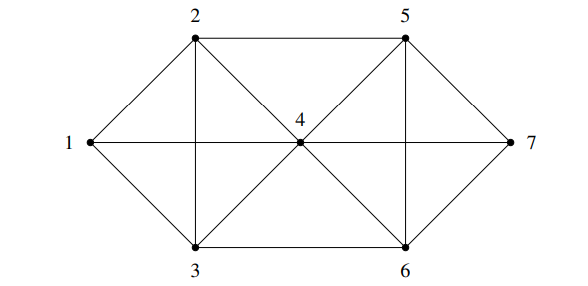
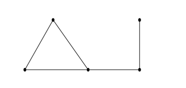

# 笔记 5

**CS 70**
**2024年春季学期**

**离散数学与概率论**
**Seshia, Sinclair**

**讨论课 2A**

## 1 欧拉回路与欧拉路径

（图中显示了一个包含7个顶点的无向图，顶点编号为1到7。）

(a) 上图中是否存在欧拉回路？ 如果不存在，请给出理由。如果存在，请提供一个例子。

(b) 上图中是否存在欧拉路径？ 欧拉路径是指每条边只经过一次的路径。如果不存在，请给出理由。 如果存在，请提供一个例子。

(c) 无向图中存在欧拉路径的条件是什么？ 请简要证明你的答案。

---

## 2 树的着色

(a) 证明所有至少有2个顶点的树都至少有两个叶节点。 回想一下，叶节点被定义为树中度恰好为1的节点。

(b) 证明所有至少有2个顶点的树都是二分图：其顶点可以被划分为两组，使得每条边都连接着两个不同组的顶点。 [提示：使用对顶点数的归纳法。]

---

## 3 度序列

图的度序列是其所有顶点的度的序列，按降序排列，并根据需要包含重复项。 例如，以下图的度序列是 (3,2,2,2,1)。

对于下面的每个部分，判断是否存在一个具有给定度序列的简单无向图 G（即没有自环和重边）。 请证明你的论断。

(a) (3,3,2,2)

(b) (3,2,2,2,2,1,1)

(c) (6,2,2,2)

(d) (4,4,3,2,1)