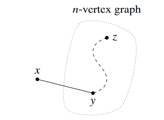

CS 70
离散数学与概率论
2024年春季 Seshia, Sinclair

**截止日期：周六, 2/3, 下午4:00**
**宽限期至：周六, 2/3, 下午6:00**

## 作业 02

### 杂项

在开始编写最终作业提交之前，请简要说明你是如何完成它的。你还和谁一起合作了？请列出姓名和电子邮件地址。（如果是家庭作业小组，你只需描述一下小组情况。）

### 1 通用偏好

假设在稳定匹配实例中偏好是通用的：所有 n 个工作都共享偏好 $C_{1}>C_{2}>\cdot\cdot\cdot>C_{n}$，所有候选人也共享偏好 $J_{1}>J_{2}>\cdot\cdot\cdot>J_{n}$。

(a) 当由工作方提出配对时，运行算法会得到什么样的配对？你能证明这对所有的 n 都成立吗？

(b) 当由候选人方提出配对时，运行算法会得到什么样的配对？

(c) 这告诉我们关于稳定配对的数量有什么信息？

### 2 配对

证明对于每个偶数 $n\ge2$，都存在一个包含 n 个工作和 n 个候选人的稳定匹配问题实例，该实例至少有 $2^{n/2}$ 个不同的稳定匹配。

### 3 上限

(a) 在笔记中，我们证明了稳定匹配算法最多在 $n^{2}$ 天内终止。请证明以下更强的结论：稳定匹配算法将总是在最多 $(n-1)^{2}+1=n^{2}-2n+2$ 天内终止。

(b) 为4个工作和4个候选人提供一组偏好列表，当运行“提议-拒绝”算法时，将达到(a)部分中的上限。通过在你的偏好列表上运行“提议-拒绝”算法来验证这一点。

---

### 4 逐步建立错误？

下面的“证明”有什么问题？除了找到一个反例，你还应该解释这种方法的根本性错误是什么，以及为什么它揭示了逐步建立错误的危险。

**错误论断**：如果一个无向图中的每个顶点度数至少为1，则该图是连通的。

**证明？** 我们对顶点数 $n\ge1$ 使用归纳法。
**基础情形**：只有一个顶点的图只有一个，其度数为0。因此，基础情形是无意义地成立的，因为如果部分是假的。
**归纳假设**：假设该论断对于某个 $n\ge1$ 成立。
**归纳步骤**：我们证明该论断对 $n+1$ 也成立。考虑一个有 n 个顶点的无向图，其中每个顶点的度数至少为1。根据归纳假设，该图是连通的。现在添加一个顶点 x，得到一个有 $(n+1)$ 个顶点的图，如下所示。

剩下的就是要检查是否存在从 x 到每个其他顶点 z 的路径。由于 x 的度数至少为1，存在一条从 x 到某个其他顶点（称之为 y）的边。因此，我们可以通过将边 {x,y} 连接到从 y 到 z 的路径上来获得从 x 到 z 的路径。这证明了该论断对 $n+1$ 成立。

### 5 图中的证明

(a) 在从旧金山交通习惯到洛杉矶交通习惯的坐标轴上，旧加州更偏向旧金山：也就是说，更文明。在旧加州，所有道路都是单行道。假设旧加州有 n 个城市 $(n\ge2)$，对于每对城市 X 和 Y，要么有从 X 到 Y 的道路，要么有从 Y 到 X 的道路。

证明存在一个城市，从任何其他城市出发，通过最多2条道路即可到达。[提示：归纳法]

(b) 考虑一个有 n 个顶点的连通图 G，它恰好有 2m 个奇数度的顶点，其中 $m>0$。证明存在 m 条路径，这些路径共同覆盖了 G 的所有边（即，G 的每条边恰好出现在 m 条路径中的一条中，并且每条路径不应多次包含任何特定的边）。

[提示：在讲座中，我们已经证明了一个连通无向图有欧拉回路当且仅当每个顶点的度数都是偶数。这个事实在证明中可能有用。]

(c) 证明任何图 G 是二分图当且仅当它没有奇数长度的环路。[提示：在其中一个证明方向，考虑从一个给定顶点出发的路径长度。]

### 6 (可选) 无胜于有

在稳定匹配问题中，假设一些工作和候选人有硬性要求，可能无法将就于任何配对。换句话说，每个工作/候选人宁愿不匹配，也不愿与偏好列表中低于某个特定点的对象匹配。我们用“实体”一词来指代候选人/工作。一个匹配最终可能是部分的，即一些实体会且应该保持不匹配。因此，这里的稳定性概念需要稍作调整，以体现工作方单方面解雇员工和/或员工自行离开的自主权。

一个匹配是**稳定**的，如果

* 不存在已匹配的实体，宁愿不匹配也不愿与当前伴侣在一起；
* 不存在已匹配/已满员的工作和未匹配的候选人，他们都宁愿与对方匹配，而不是维持现状；
* 不存在已匹配的工作和已匹配的候选人，他们都宁愿与对方匹配，而不是与当前伴侣在一起；
* 以及，同样地，不存在未匹配的工作和已匹配的候选人，他们都宁愿与对方匹配，而不是维持现状；
* 不存在未匹配的工作和未匹配的候选人，他们都宁愿与对方匹配，也不愿保持不匹配状态。

(a) 证明在允许实体不匹配的情况下，稳定的配对仍然存在。（提示：你可以通过引入虚拟实体来解决这个问题，当工作/候选人未匹配时，他们就与这些虚拟实体“匹配”。你应该如何调整工作/候选人的偏好列表，包括新引入的虚拟实体的偏好列表，以使其奏效？）

(b) 正如你在讲座中看到的，我们可能会有不同的稳定匹配。但有趣的是，如果一个实体在一个稳定匹配中未匹配，那么在任何其他稳定匹配中它也必须保持未匹配。请用反证法证明这一事实。
